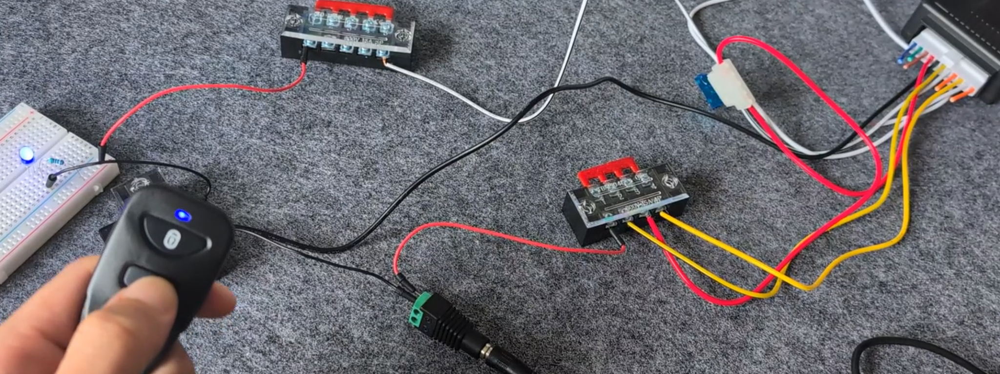

# Cyber Threats on Wheels: Evaluating Penetration Testing Tools Against Vehicle Vulnerabilities

A final year project by **Munro Amarasai Cockburn**, for the BSc (Hons) Degree in Cyber Security and Digital Forensics at Kingston University London.

---

## Introduction

In an ever more technologically reliant world, the automotive vehicle has embraced the digital age. The rise of electric and connected vehicles introduces advanced features like self-driving capabilities and sophisticated infotainment systems, but also significant cybersecurity risks. This project assesses the cybersecurity vulnerabilities of modern vehicles by using common penetration testing methods to help manufacturers identify weaknesses and enhance vehicle security.

***

## Aims and Objectives

The primary goal of this project is to evaluate vehicle cybersecurity vulnerabilities through practical penetration testing. The key objectives are to:

**Identify vulnerabilities** within vehicle software, hardware, and network components.
**Assess exploitation risks** by evaluating the likelihood of these vulnerabilities being exploited.
**Simulate penetration tests** using widely adopted methods.
**Develop a threat model** to map potential attacks and their consequences.

***

## Methodology and Tools

This project uses a hybrid of **Agile and Waterfall** project management methodologies to structure the research and implementation phases. The practical demonstrations focus on two main types of attacks: a **Replay Attack** on a keyless entry system and an **Evil Portal Phishing Attack** simulating a public transport WiFi network.

### Hardware Used:

**Flipper Zero**: A portable multi-tool for penetration testing, used here to capture and replay radio frequencies.
**M5StickC PLUS2**: A small, programmable IoT device used to create the malicious WiFi network.
**Keyless Entry System**: A generic system to simulate a vehicle's locking mechanism in a controlled environment.

 

---

## Demonstrated Attacks

### Replay Attack on Keyless Entry System

This test demonstrates how an attacker can capture the radio frequency signal from a key fob to unlock a vehicle.

1.  **Setup**: A keyless entry system was wired to a power supply to simulate a car's locking system.
2.  **Signal Capture**: The Flipper Zero, running Momentum firmware, was used to listen for and record the unlock signal from the key fob.
3.  **Execution**: The captured signal was then re-transmitted by the Flipper Zero, successfully unlocking the system.

> This demonstrates a significant vulnerability in older vehicles that use fixed-code keyless systems, highlighting the ease with which such an attack can be performed.

### Evil Portal Phishing Attack

This scenario simulates an attacker creating a fake public WiFi network on public transport to steal user credentials.

1.  **Firmware Installation**: The M5StickC PLUS2 was flashed with Bruce firmware to enable its WiFi hacking capabilities.
2.  **Portal Setup**: An "Evil Portal" was created, broadcasting a convincing SSID like "TFL Free WiFi" to lure unsuspecting victims.
3.  **Credential Theft**: When a user connects, they are presented with a fake login page (e.g., a Google sign-in page). Any credentials entered are captured and stored for the attacker to retrieve.

---

## Conclusion

This project successfully demonstrated significant cybersecurity vulnerabilities in automotive contexts through practical, simulated attacks. The ease of executing a replay attack on older keyless entry systems and the effectiveness of a phishing attack on public WiFi highlight the critical need for robust security measures. While the scope was limited to specific hardware and network-based attacks, the findings underscore the importance of ongoing security research and the development of countermeasures to protect drivers and passengers.
